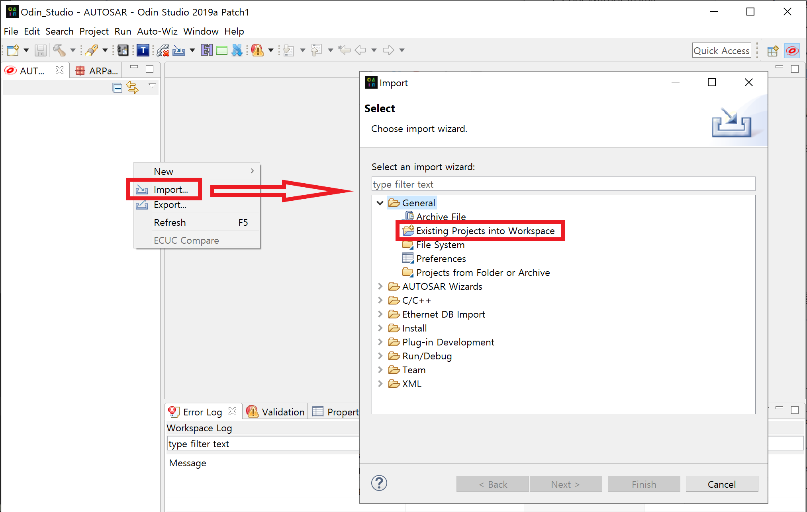
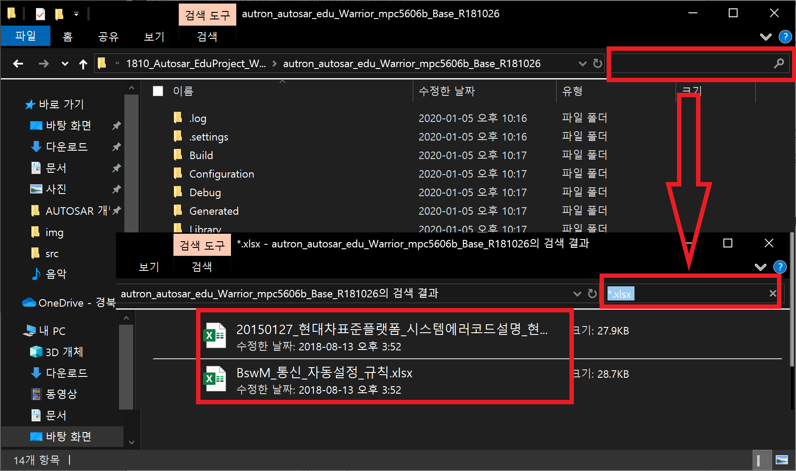
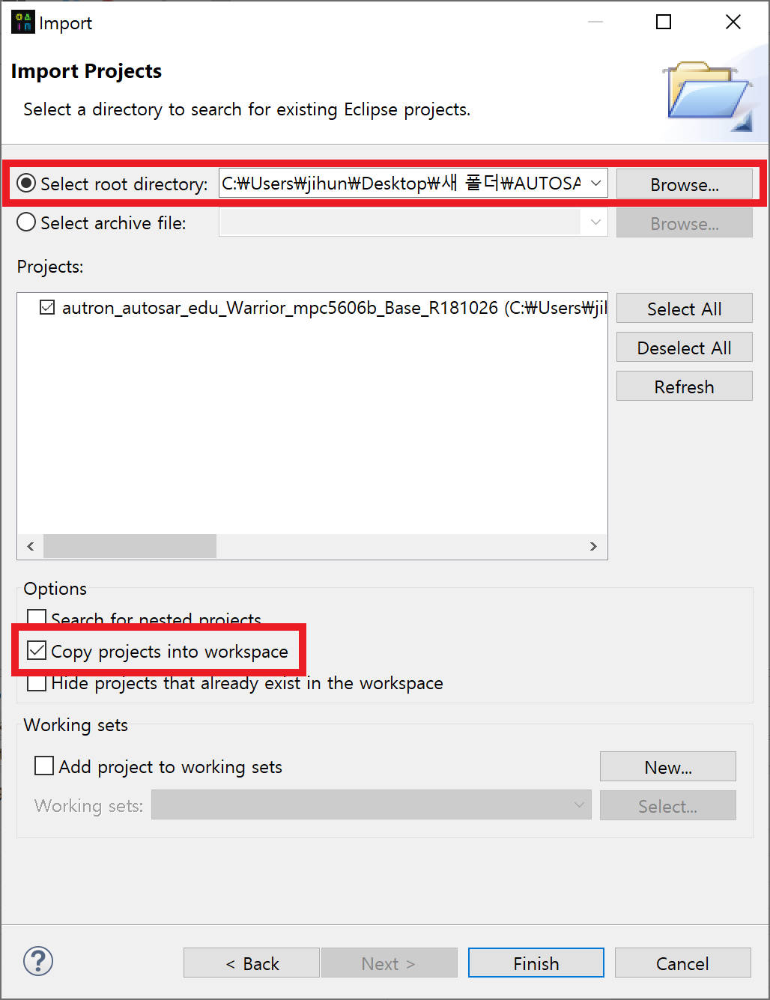
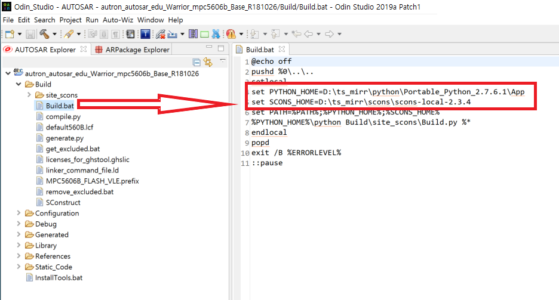
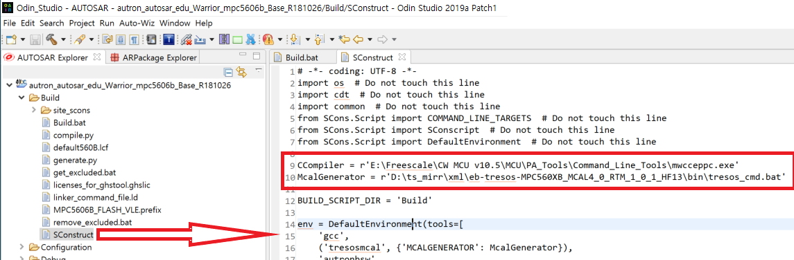
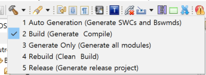
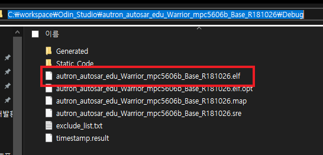

**툴셋 환경설정은 하기 내용을 참고하시기 바랍니다.**

 

\1.   CW Compiler 및 디버거 설치 : 실습용_설치파일_1.zip > Debug > EVB_CD.zip 해제 후 설치, CodeWarrior 디버그 사용법_R0.pdf 참고

※ CW Compiler  설치 후 mwcceppc.exe 파일이 존재하는 로컬 경로에 맞게 수정 , AUTOSAR개발환경_교육용_CodeWarrior.pptx 참고

예를 들어 C드라이브에 CodeWarrior 설치 한다면 해당 파일이 하기 경로와 같이 자동 잡히며, Sconstruct 파일에 동일하게 수정

à r'C:\Freescale\CW MCU v10.5\MCU\PA_Tools\Command_Line_Tools\mwcceppc.exe'

※   Freescale OS 코드 생성을 위하여 jre 별도 설치 : jre-8u66-windows-i586.exe 실행

 

\2.   Mcal 설치 : eb-tresos-MPC560XB_MCAL4_0_RTM_1_0_1_HF13 압축 해제 후 해당 폴더를 사용 중인 로컬 경로 의 tr_mirr 폴더 > xml 밑에 복사

 

\3.   기타 툴 설치: ACT_2.2.9 à 오트론 CAN Test 툴, Vector_Driver (CAN CASE VN1630A 등 지원)

 

# Code Warrior 설치

## 1. CodeWarrior Install

`Debug\EVB_CD\Software\setup.exe`  "**관리자 권한**" 실행 및 설치 진행

Code Warrior설치중 아래와 같이 선택하고 계속 진행

설치가 완료되면 장치 관리자에서 아래와 같이 연결한 보드(TRK-MPC5606B Board)가 포트에서 보이는지 확인하다.

## 2. Debug Patch

CodeWarrior 설치 직후 그대로 사용하면 Debug 연결이 안 된다. 추가 Plugin을 설치해주기 위해

`Debug\FlashAlgorithms_Internal_FREESCALE_QORIVVAP` 폴더 하위 파일들을 

`C:\Freescale\CW MCU v10.5\MCU\bin\plugins\support\EPPC\gdi\P&E` 아래 폴더 위치에 덮어쓰기 해준다.

## 3. workspace 설정 및 Target Debugging 예제

CodeWarrior를 실행하면 아래와 같이 workspace 설정하는 창이 뜬다. 자신이 원하는 위치에 workspace를 설정해준다. **(단, 위치에 한글경로 이름이 있으면 안되니 주의한다.)** 

Project가 없는 상태로 CodeWarrior가 실행된다. 예제 elf파일을 실행하려고만 하므로 왼쪽아래 항목에서 Import MCU executable file을 실행한다.

Project이름을 설정해주고 import file은 `Debug\e_autosar_edu_mpc5606b_Base.elf` 파일로 설정한다. 

Target MCU를 선택해준다. `Qorivva \ MPC560xB/C/D Family \ MPC5606B`에 있다.

왼쪽 창에 Project가 생긴 것을 볼 수 있다. 디버깅을 위해 벌레모양 옆 화살표를 클릭하여 Debug configuration을 선택한다.

아래 그림과 같이 되어있는지 확인하고

<Target settings에서 Edit을 누르고 아래와 같이 나오는지확인> 그리고 Debug클릭

# Odin Studio 

## 설치

### 1. ODIN Studio 설치

`OdinStudio2019a_Patch1_x86_64` 파일 압축 해제. 이 파일은 portable 형식이다. 폴더 아래에 `Odin.exe`를 실행하면 툴이 실행된다.

### 2. Tool-Chain 설치

1. `ts_mirr.zip`를 `C:\`위치에 압축 해제한다. 최종 결과가 `C:\ts_mirr`가 되도록 한다. **반드시 압축 해제를 해당 위치에 풀 것!, 하위 파일 중 경로가 너무 길어서 다른곳에 풀었다가 옮길 수 없기 때문이다. **
2. `gcc-arm-none-eabi-7-2017-q4-major-win32-sha1`파일을 실행 및 설치

### 3. Debugger설치

--> Code warrior로 진행하면 된다.

## 실행

### 1. 실행

`Odin.exe`를 실행한다. 실행하고 나면 workspace설정창이 뜬다. 자신이 원하는 위치를 설정하면 된다. (역시 경로에 한글 및 공백이 포함되면 안된다.)

이후 Odin이 켜지면 License설정창이 뜬다. 자기가 가지고있는 네트워크 모듈 넘버와 같은 파일을 `license\fw`에서 찾아서 등록하면 된다.

### 2. 프로젝트 생성

왼쪽 ATUOSAR Explorer 창에서 우클릭하여 import를 선택 후, Existing Projects into Workspace를 선택.

우선 프로젝트를 가져오기 전에 예제 프로젝트들에 있는 한글이름 파일을 수정해줘야 한다. 아래와 같이 프로젝트 폴더에서 `*.xlsx`를 검색하여 나오는 한글이름 파일들을 아무 영어로나 바꿔준다.

다시 돌아와서 `Select root directory`를 선택후 프로젝트 젤 상위 폴더를 지정해준다. 아래쪽 option에서 표시되어 있는 체크박스를 선택하면 workspace에 해당 프로젝트를 복사하여 열어주고, 선택하지 않는다면 프로젝트 경로가 그대로 인식되게 된다.(되도록 workspace에 복사하자.) 이후 완료버튼 누른다.

### 3. 프로젝트 빌드

* External Tool 경로 수정

build파일에서 ts_mirr폴더 경로를 자신이 정한 위치에 맞게 수정해 준다.

SConstruct 파일에서도 CCompiler alc McalGenerator경로를 알맞게 설정해준다.

(여기서 모두 C:\~~~~로 바꾸면 된다.)

* build project

망치모양에서  Build (Generate Compile)을 한다.

### 4. 디버깅

빌드가 완료되면 자신의 workspace디렉토리에 프로젝트 폴더안 Debug폴더 아래에 elf파일이 생성된다. 이 elf파일을 Code Warrior에 가져가서 디버깅을 하면된다.

